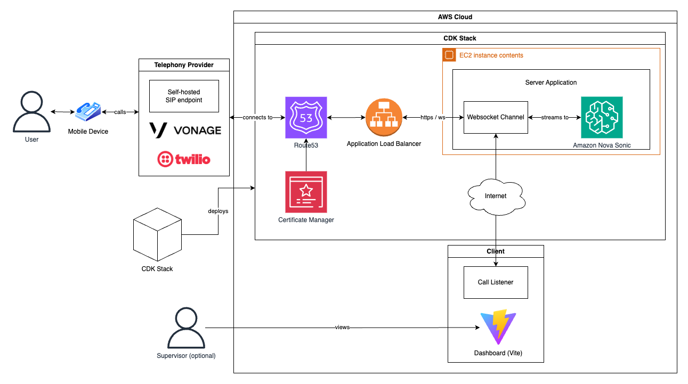

# Nova Sonic Contact Center with Telephony
Authors: Andrew Young <ajuny@amazon.com>, Reilly Manton <rcmanton@amazon.com>

This solution introduces a comprehensive analytics dashboard for monitoring and enhancing Amazon Bedrock's Nova speech-to-speech model interactions in a customer support context. The dashboard provides real-time sentiment analysis with visual trend graphs, overall call sentiment visualization via donut charts, AI-powered agent guidance, and key performance metrics including agent/customer talk time percentages and response times. All frontend analytics are powered by Amazon's Nova Lite model, while the backend S2S model features knowledge base integration for improved response accuracy, creating a powerful toolkit for enhancing telco customer support operations.

## Architecture


## Setup

### Prerequisites
- npm
- AWS Account with Bedrock access to Nova S2S model
- AWS CLI credentials
- Microphone and speakers

From the root folder, run `npm install`

### Set up client (front-end)
1. Deploy an EC2 server by running `cdk deploy` inside `src/server/deploy/`
2. The application uses environment variables for AWS authentication. You'll have Replace `accessKeyId` and `secretAccessKey` in `src/frontend/config.ts` with your access key and secret key. You'll need to do this even if you've already exported them to your command-line environment.
```
AWS_ACCESS_KEY_ID="your-access-key"
AWS_SECRET_ACCESS_KEY="your-secret-key"
AWS_DEFAULT_REGION="us-east-1"
```
3. To launch the client app, run `npm run client`

### Set up server (back-end)
There are 2 ways to run this server: over a telephony provider such as Vonage / Twilio / a SIP endpoint, or over the web.

If you need inbound telephony, we strongly recommend running the server remotely on an EC2 instance and using SSL. There are other ways to do this such as `ngrok` or `localtunnel`, but EC2 is by far the most secure and we do not endorse the other approaches. These approaches will accept *web and SIP traffic*.

If you do not need inbound telephony, or you only want to test the server, then you can simply host the server on `localhost`. This will accept *only web traffic*

#### Option 1: Running the server locally over the internet
1. Export your environment variables locally:
```bash
> export AWS_ACCESS_KEY_ID="your-access-key"
> export AWS_SECRET_ACCESS_KEY="your-secret-key"
> export AWS_DEFAULT_REGION="us-east-1"
```
2. Update your .env file with the location of your web server (e.g. `localhost` or a DNS URL like `mydomain.example.com`)
3. If you want to access your server over localhost from a web application, then you have nothing further to do. Simply access the app using your client. Note that you will not be able to accept inbound calls over the internet. If you want to accept inbound calls, you should instead run the server remotely using SSL (see below)

#### Option 2: Running the server remotely using SSL (with inbound telephony)
1. `scp` over the full contents of `src/server/`
```bash
> scp -r -i <path-to-PEM-file> ./*  ec2-user@<ec2-ip-address>:~
```
2. SSH into your EC2 instance using your private key that you created when you deployed the app. 
```bash
> ssh -i <path-to-PEM-file> ec2-user@<ec2-ip-address>
```
3. On your SSH server, run `npm install` to install all packages.
4. Ensure that your networking configuration will accept traffic to port `443` and port `3000` (with our CDK package, this is true by default)
5. Export your environment variables locally:
```bash
> export AWS_ACCESS_KEY_ID="your-access-key"
> export AWS_SECRET_ACCESS_KEY="your-secret-key"
> export AWS_DEFAULT_REGION="us-east-1"
```
5. To run the application, run:
```bash
> sudo AWS_ACCESS_KEY_ID=$AWS_ACCESS_KEY_ID AWS_SECRET_ACCESS_KEY=$AWS_SECRET_ACCESS_KEY AWS_SESSION_TOKEN=$AWS_SESSION_TOKEN ts-node server.ts
```

##### Set up telephony provider

###### With Vonage
1. Go to vonage.com
2. If you don't already have an account, sign up for a Vonage account and ensure you have enough balance.
3. Once you have an account, log in to the Vonage Communications API dashboard.
4. On the left-side menu, click Applications. 
5. On the main screen, click `+ Create new application`
6. Under Capabilities, enable Voice capabilities. 
7. For the Answer URL, make it an `HTTP GET` to `<your-hostname>/webhook/answer`
7. For the Event URL, make it an `HTTP POST` to `<your-hostname>/webhook/event`
8. For the Fallback URL, make it an `HTTP POST` to `<your-hostname>/webhook/fallback`
9. Create and associate a phone number to your application. You may need to purchase a phone number to do this.

### Running the app
1. Ensure that the Server is running with environment variables configured, and able to receive traffic
2. Place a call to the phone number that you created in your app
3. If you wish to have other participants join the call, paste the call ID (which you can find in the Server logs) into the client (front-end) dashboard.
4. Your call will now be working, and anything you say into your device will be picked up by the client and server app.

### Custmization
- to customize the AI insights and user sentiment prompting, see `ui-stream/src/bedrockSentimentAnalyzer.ts`
